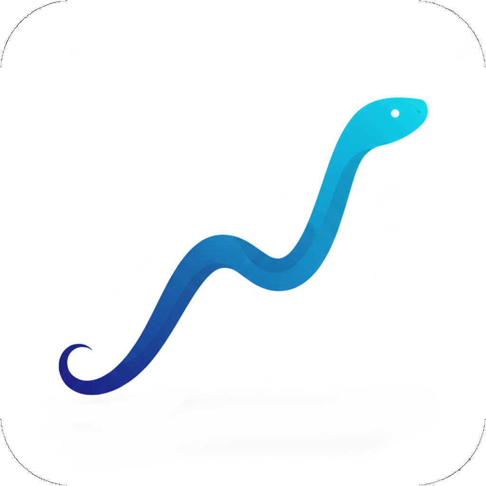

<p align="center">
  
</p>

<h1 align="center">nordpy</h1>

<p align="center">
  A terminal UI for browsing and exporting your Nordnet portfolio data.
</p>

<p align="center">

<a href="https://github.com/j178/prek"></a>
<a href="https://github.com/astral-sh/uv"></a>
<a href="https://github.com/astral-sh/ruff"></a>
<a href="https://github.com/astral-sh/ty"></a>
<a href="https://github.com/tox-dev/tox-uv"></a>
<a href="https://pydantic.dev/"></a>
<a href="http://commitizen.github.io/cz-cli/"></a>
<br>
<a href="https://github.com/kiliantscherny/nordpy/actions/workflows/ci.yml"></a>
<a href="https://github.com/kiliantscherny/nordpy/actions/workflows/release.yml"></a>

---

> [!CAUTION]
> **Disclaimer** – This tool is provided as-is, with no warranty of any kind. **Use it at your own risk**.
>
> This project is not affiliated in any way with Nordnet nor MitID.
>
> The author assumes no liability for any loss, damage, or misuse arising from the use of this software. You are solely responsible for securing any exported data and ensuring it is only accessible to you.

## Features

- Browse accounts, balances, holdings, transactions, trades, and orders
- **Portfolio value chart** and **instrument price charts** in the terminal
- **Sparkline trends** on holdings (3-month price history via yfinance)
- Export data to **CSV**, **Excel**, or **DuckDB**
- Session persistence with automatic re-authentication
- Headless export mode (no TUI) for scripting
- SOCKS5 proxy support

## How It Works

nordpy authenticates with Nordnet through the same MitID flow your browser uses – it simply performs the login via Nordnet's API directly from the terminal, rather than through a web page. Once authenticated, it fetches your portfolio data using Nordnet's standard API endpoints.

> [!IMPORTANT]
> **Privacy** – nordpy does **not** collect, transmit, or store any of your personal information. Your credentials are sent directly to MitID and Nordnet – never to any third-party server. Session cookies are saved locally on your machine (with `0600` permissions) solely to avoid repeated logins. No telemetry, analytics, or external services are involved.

## Requirements

- Python 3.10–3.13
- A Nordnet account with MitID (Danish)

## Installation

### With uv

```bash
uv add nordpy
```

### With pip

```bash
pip install nordpy
```

## Usage

### Interactive TUI

```bash
nordpy --user <your-mitid-username>

# Force re-authentication (ignore saved session)
nordpy --user <your-mitid-username> --force-login

# Verbose logging (debug output to stderr + nordpy.log)
nordpy --user <your-mitid-username> --verbose

# Delete saved session and exit
nordpy --logout
```

> [!NOTE]
> The first time you log in, you may be prompted to enter your **CPR number** as part of the MitID verification process. This is a one-time step required by MitID to link your identity – subsequent logins will skip this.

### Headless Export

```bash
nordpy --user <your-mitid-username> --export csv
nordpy --user <your-mitid-username> --export xlsx
nordpy --user <your-mitid-username> --export duckdb

# Export to a specific folder
nordpy --user <your-mitid-username> --export csv --output-dir ~/my-exports
```

Exported files are saved to the `exports/` directory.

> [!WARNING]
> Exported files contain sensitive financial data. Make sure you do not share these filesnor commit them to version control. Keep your exports in a secure location accessible only to you.

### Keybindings

| Key | Action |
|-----|--------|
| `Enter` | Select account / view instrument chart |
| `Tab` | Switch between tabs |
| `e` | Export current view |
| `r` | Refresh data |
| `Backspace` / `Esc` | Go back / quit |
| `q` | Quit |

## Development

```bash
git clone https://github.com/kiliantscherny/nordpy.git
cd nordpy
uv sync --dev
```

### Running checks

```bash
# Run all checks (tests on Python 3.10–3.13, lint, type check)
uv run tox

# Run tests only
uv run pytest

# Run tests with coverage
uv run pytest --cov=nordpy --cov-report=term-missing

# Lint
uv run ruff check .

# Type check
uv run ty check
```

## License

This project is licensed under the [MIT License](LICENSE).

## Acknowledgments

This project includes code from [MitID-BrowserClient](https://github.com/Hundter/MitID-BrowserClient) by Hundter, licensed under the MIT License.

Credit also to [Morten Helmstedt](https://helmstedt.dk/2025/03/hent-dine-nordnet-transaktioner-med-mitid/) for the groundwork of looking into this.
